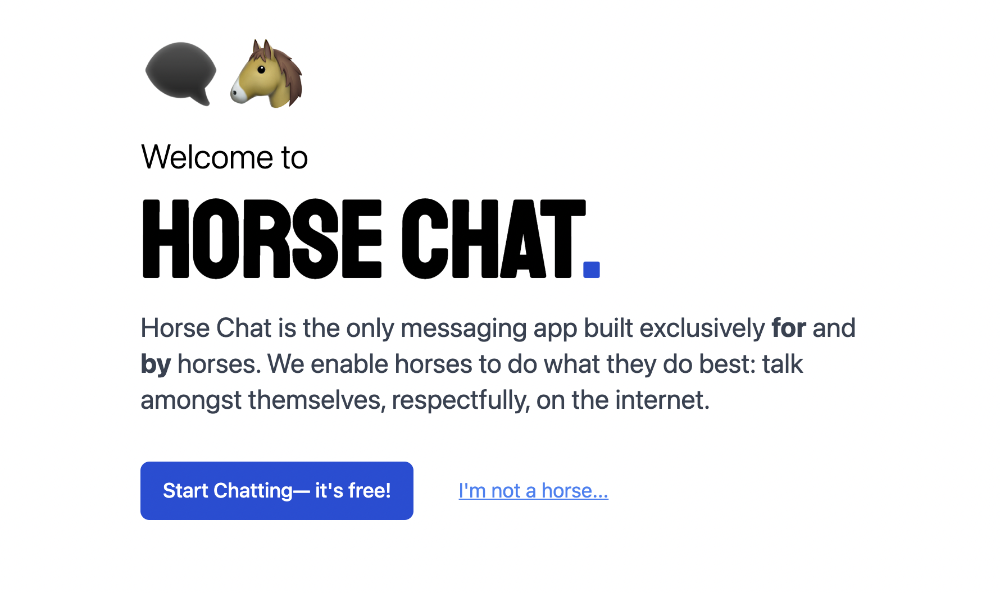

# Horse Chat

## The Initial Goal

The main goal was to build a chat app with various user stories as part of a group challenge. For multiple reasons, the thought of building a chat app wasn't super interesting; after all, they all do the same thing.

So, what would make mine different? I do that know all of the messaging apps I use (slack, discord, WhatsApp, etc.) focus all their energy on humans and **completely miss the horse market**.

I've always had a soft spot for absurd comedy, and the thought of a messaging app built for horses was **very** intriguing to me. It's a dumb idea -- and taking a dumb idea seriously is always a delight. I think for all the wonderful things and innovation on the internet, we don't use it as a platform for comedy or sketches nearly enough.

So, with this horse app, a few new challenges presented themselves that weren't in the original project. While I couldn't satisfy all the requirements in time, I'm pretty proud of the ridiculous little app that I spit out in a few days.

## Live Demo

A live demo of the project can be found [here](https://the-drawing-app.vercel.app/). You can enter the chat as a horse by authenticating through Github. OR, if you are a human, you can still get a feed of all the messages coming in -- but they are encrypted -- once again, this is an app built for horses, not humans.

## User Stories

As mentioned, the initial concept for the app came from a coding challenge via the [devjam](https://devjam.vercel.app/project/Chat-App-9) group. I was able to satisfy the following user stories:

### Dev Jam User Stories

📔 User Stories

1. ✅ user is prompted to enter a username when he visits the chat app. The username will be stored in the application
2. ✅ user can see an input field where he can type a new message
3. ✅ By pressing the enter key or by clicking on the send button, the text will be displayed in the chatbox alongside his username (e.g. John Doe: Hello World!)

⭐ Bonus features (optional)

1. ✅ The messages will be visible to all the Users that are in the chat app (using WebSockets)
2. ✅ When a new user joins the chat, a message is displayed to all the existing Users
3. ✅ Messages are saved in a database

🧠 New User Stories

1. ✅ Messages are encrypted
2. ✅ Only Horses can read/decrypt the messages

## Tech Stack

I wasn't initially into the idea of a chat app because I've built similar things before, and having to manage a WebSocket server, a front end, a database just for a demo project for a few days is a lot of overhead. So, I decided to take a fully serverless approach to the app. This approach allowed me to continue using Next.js and Vercel and dabble in some new services/tech I hadn't worked with before.

### Dependencies

- [Next.js](https://nextjs.org/) (framework)
- [tailwindcss](https://tailwindcss.com) (styling)
- [Pusher](https://pusher.com/) (realtime data )
- [Upstash](https://upstash.com/) (Redis -- used as db/store for messages)

### The message flow

So, in a serverless world, how does a messaging app work? It's pretty simple, sraightforward, and the mental model is the same as if it were on a dedicated server(s).

#### Subscribing to a channel via Pusher

Pusher is a service that uses what they call pusher channels for real-time data. You can think of it really as WebSockets as a service.

When users join the chat room at `/chat/[channelName]`, they subscribe to the `#[channelName]`pusher thread. Now, anytime our hosted Pusher instance receives an event in that namespace, any subscribed users will also receive it. An authorized user will decrypt the message with the key they received from the server when they logged in at`/api/getEncryption` -- the LEAST OBVIOUS API ROUTE NAME.

#### Sending events

Whenever a user sends a message, the text is encoded using the secret key they got from the server and then posted to the `/api/chat/[channelName]` route. While not the most secure approach, it's better than nothing and was my first time flexing any encryption skills.

This route ensures the user is authorized first. Then, the message is formatted and stored into the Redis cache via upstash.

Then the message is added into a sorted set with the **key** `#channel:[channelName]`, the **score** of the current time, and the **value** of the stringified/formatted message with encryption.

By leveraging a sorted set, we can quickly ensure the messages are sorted by their score -- the time they were received.

We then send an event w/ the message to Pusher instance at`#[channelName]`, and any client listening to that channel will receive the message.
